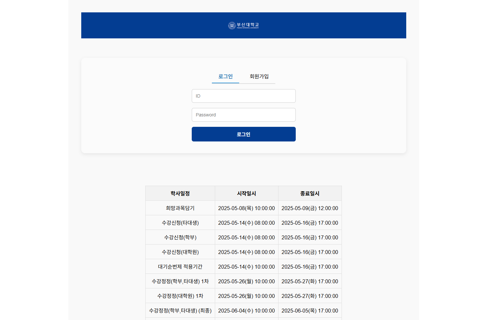
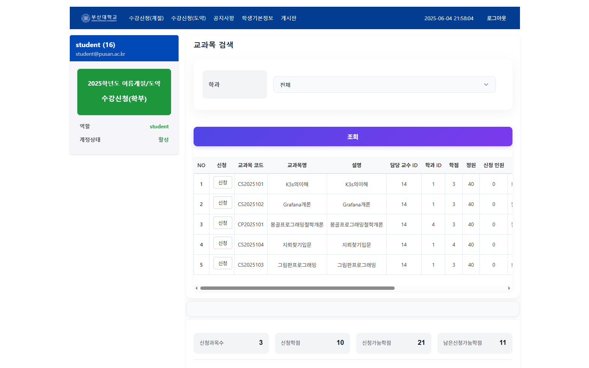
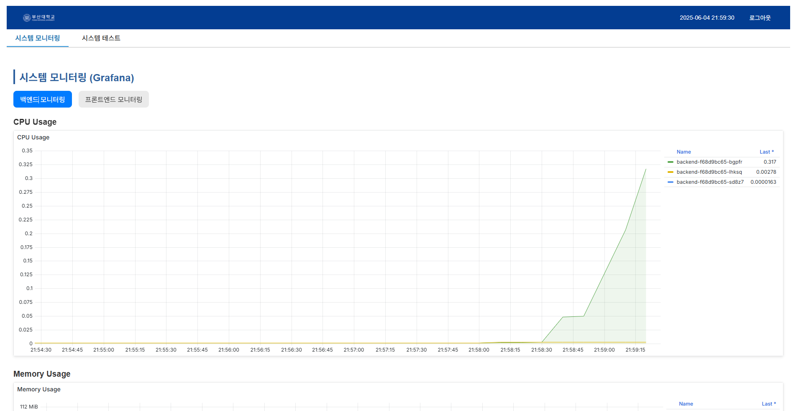
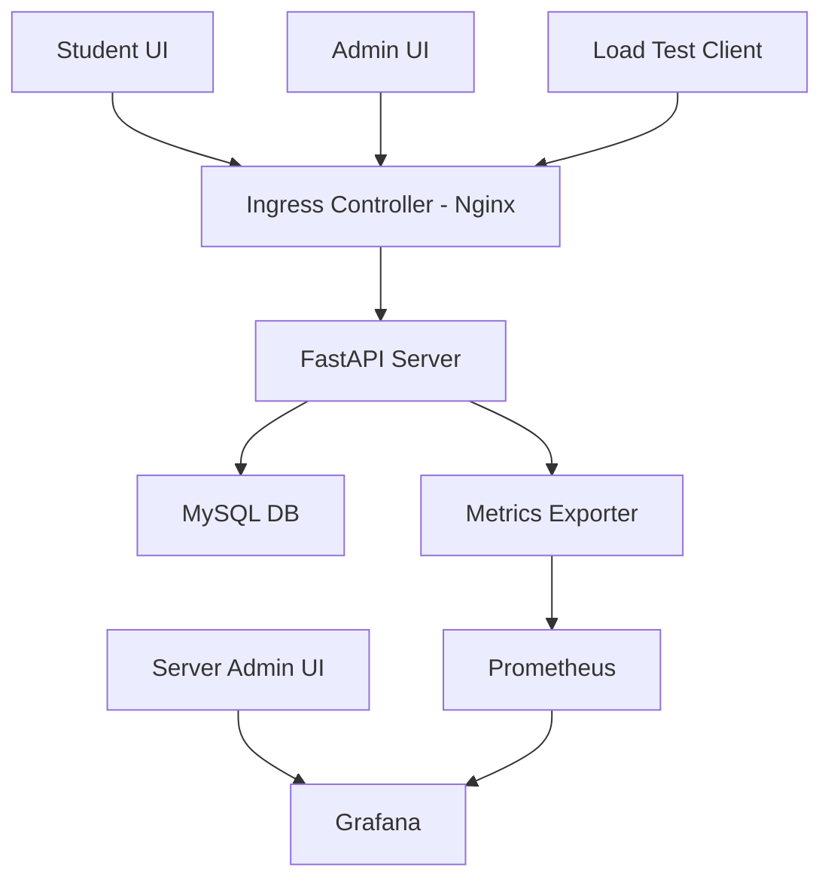

# 🎲 부산대학교 정보컴퓨터공학부 2025학년도 1학기 클라우드컴퓨팅 텀 프로젝트 - 9조

> **K3s 기반 다중 노드 Kubernetes 환경에서 안정적인 운영이 가능한 수강신청 서비스 개발**








## 프로젝트 소개

- 본 프로젝트는 대학생이 가장 빈번하게 사용하는 **수강신청 서비스**에서, 접속자가 급격히 몰려도 안정적으로 운영될 수 있도록 **서버를 컨테이너화**하여 **자동 확장** 및 **부하 분산** 기능을 갖춘 웹 서비스를 구현하는 것을 목표로 합니다.

- **K3s 기반 다중 노드 Kubernetes 클러스터 환경**에서 **FastAPI 서버**를 배포하며, CPU 부하량 기반의 **HPA**(Horizontal Pod Autoscaler)를 적용합니다.

- **Grafana**를 활용하여 실시간으로 클러스터 상태와 리소스 사용 현황을 시각화하여, Kubernetes 환경에서의 확장성과 안정성 확보 메커니즘을 **시연 가능한 형태로 구현**했습니다.


## 프로젝트 필요성

- **접속 폭주에 따른 서버 다운 문제**  
  수강신청 시작 직후 수천 명이 동시에 접속하면서 응답 지연과 접속 불가 현상이 빈번하게 발생

- **자체 IDC 한계**  
  부산대학교 내부 IDC에서 운영하는 수강신청 서버는 자동 확장 기능이 없어 트래픽 급증에 대응이 어려움

- **클라우드와 온프레미스 하이브리드 필요**  
  민감한 개인정보는 내부 시스템에 유지하면서, 수강신청 로직과 UI는 클라우드 컨테이너 환경으로 분리 운영 필요


## 프로젝트 멤버 및 담당 파트

| 이름   | 담당 파트 및 주요 역할                                                                                         |
|--------|--------------------------------------------------------------------------------------------------------------|
| **지웅**   | 수강신청시스템 UI 구성<br>학생 관점 UI: 강의 검색, 신청/취소, 현황 확인<br>강의 관리자 UI: 강의 개설/수정, 목록 및 상태 표시<br>서버 관리자 UI: 실시간 트래픽 모니터링, HPA 리소스 관리, 부하 테스트 |
| **상해**   | FastAPI 백엔드 개발<br>MySQL DB 설계 및 구축<br>학생, 수강신청, 강의 CRUD API 구현<br>자동화 테스트 코드 작성                                             |
| **민준**   | K3s 클러스터 구성<br>노드 연결 및 네트워크 설정<br>클러스터 내 Pod 부하 분산 및 자동 확장 기능 구현<br>Prometheus 및 Grafana를 통한 시각화 기능 구현                      |


## 기술 스택

### Front-end

<span>


</span>

---

### Back-end

<span>


</span>

---

### Cluster

<span>


</span>


## 관련 기술 및 사례

| 서비스명      | 인프라 구성 및 특징                                                                                             |
|---------------|--------------------------------------------------------------------------------------------------------------|
| **인터파크 티켓** | 자체 IDC + AWS 하이브리드, Docker/K8s MSA, Oracle/MS-SQL 혼용 DB, AWS Auto Scaling 및 K8s HPA, NetFUNNEL 가상 대기실 활용 |
| **예스24 티켓팅** | 온프레미스 Windows Server + IIS, 모놀리식 ASP.NET, 사전 용량 확보 + IIS ARR LB, NetFUNNEL 대기열 적용              |
| **멜론 티켓**     | 카카오 자체 DC 기반 Private Cloud, 카카오 내부 K8s 사용 추정, MSA REST API, AI 봇 차단 및 프로액티브 스케일링 적용    |

- **NetFUNNEL 가상 대기실**  
  급증하는 트래픽을 큐에 적재해 순차적으로 요청 처리, 서버 과부하 방지 및 봇 차단 기능 제공

- **오토스케일링과 부하 분산**  
  Kubernetes HPA, 클라우드 오토스케일링, L7 로드 밸런서 등이 핵심 기술로 활용됨


## 개발 결과

*세부 구조는 개별 모듈 디렉토리의 README 참조*

- K3s 다중 노드 클러스터 환경 

- FastAPI 기반 수강신청 백엔드 서버 컨테이너 이미지  

- MySQL 데이터베이스 연동 및 도메인별 CRUD API 구현  

- HPA를 통한 자동 확장 및 부하 분산 설정  

- Prometheus 및 Grafana 기반 실시간 모니터링 시스템  

- 학생, 강의 관리자, 서버 관리자 UI (React 기반)  

- 부하 유도용 API 엔드포인트 포함


## 시스템 아키텍처




## 설치 및 실행 방법

### 단일 환경 테스트

#### 전체 실행 방법 (Docker 기반)

1. 저장소 클론

   ```bash
   git clone https://github.com/jiwoong5/Team-Cloud-9.git
   ```

2. .env 파일 설정

   루트 디렉토리에 .env 파일을 생성하고 다음과 같이 작성합니다.

   ```env
   # backend 환경 변수
   DATABASE_URL=mysql+pymysql://root:비밀번호@db:3306/your_db
   SECRET_KEY=랜덤한_비밀키
   ALGORITHM=HS256
   ACCESS_TOKEN_EXPIRE_MINUTES=30
   ```

   .env 파일은 민감 정보이므로 .gitignore에 추가하고 다음 명령어로 Git 추적에서 제거합니다.

   ```bash
   echo ".env" >> .gitignore
   git rm --cached .env
   git add .gitignore
   git commit -m "chore: ignore .env file"
   git push
   ```

3. Docker 환경 구성

   docker-compose.yml 파일을 루트 디렉토리에 생성하고 아래 내용을 추가합니다.

   ```yaml
   version: '3.8'
   services:
     db:
       image: mysql:8.0
       container_name: mysql-db
       restart: always
       environment:
         MYSQL_ROOT_PASSWORD: <비밀번호>
         MYSQL_DATABASE: your_db
       ports:
         - "3306:3306"
       volumes:
         - db_data:/var/lib/mysql

     backend:
       build:
         context: ./backend
       container_name: backend-app
       restart: always
       ports:
         - "8000:8000"
       env_file:
         - .env
       depends_on:
         - db

     frontend:
       build:
         context: ./frontend/sugang-system
       container_name: frontend-app
       restart: always
       ports:
         - "3000:3000"
       environment:
         - REACT_APP_API_BASE_URL=http://localhost:8000
       stdin_open: true
       tty: true
       depends_on:
         - backend

   volumes:
     db_data:
   ```

4. 실행

   ```bash
   docker-compose up --build
   ```

   프론트엔드: http://localhost:3000

   백엔드 API: http://localhost:8000

5. 종료

   ```bash
   docker-compose down
   ```

- 참고

    - 프론트엔드는 REACT_APP_API_BASE_URL 환경 변수로 백엔드와 통신합니다.

    - 백엔드는 애플리케이션 시작 시 SQLModel을 기반으로 테이블을 자동 생성합니다.

    - uv를 사용하는 로컬 개발은 선택이며, 운영에서는 Docker로 실행하세요.


### 클러스터 환경 테스트

*K3s 기반 Kubernetes 클러스터 환경이 이미 구축되었다고 가정*

*클러스터 구축 방법은 [cluster/README](./cluster/README.md) 참고*

1. 웹 서버 / API 서버 컨테이너 이미지화 및 Docker Hub Push

   ```Bash
   docker build -t <Docker Hub 아이디>/frontend .
   docker push <Docker Hub 아이디>/frontend
   ```

   ```Bash
   docker build -t <Docker Hub 아이디>/backend .
   docker push <Docker Hub 아이디>/frontend
   ```

2. [배포 설정 파일](./cluster/tests/test-hpa.yaml) 작성

3. 클러스터 내 배포

   ```Bash
   kubectl apply -f backend.yaml
   kubectl apply -f frontend.yaml
   ```

4. 웹 브라우저에서 설정한 NodePort 주소로 접근


## 활용 방안

1. **교육용 Kubernetes 실습 환경**
   
   다중 노드 클러스터에서 오토스케일링, 부하 분산, 모니터링 기능을 직접 체험할 수 있습니다.

2. **수강신청 서비스 개선 연구**

   실제 대학 환경에 적용 가능한 자동 확장 기반 수강신청 시스템 설계 및 운영 방안을 검증할 수 있습니다.

3. **부하 테스트 및 시스템 안정성 평가**
   
   급격한 트래픽 변화에 따른 시스템 반응과 확장성, 장애 대응 시나리오를 시연할 수 있습니다.

4. **확장 가능한 웹 서비스 배포 예시**

   FastAPI + K3s 기반 컨테이너 배포 및 관리 실무 가이드로 활용 가능합니다.

---

- 본 프로젝트는 K3s 기반 클라우드 환경에서의 자동 확장 시스템 구축 및 운영을 실습하기 위한 교육용 프로젝트이자, 실제 수강신청 시스템의 시뮬레이션 모델로 활용 가능합니다. 구축된 인프라 및 서비스는 다음과 같은 방안으로 응용 및 확장이 가능합니다.

    1. **클라우드 인프라 학습 플랫폼**

        - K3s 클러스터 구성, Helm 배포, HPA 설정, 모니터링 시스템 구축 등의 실습 템플릿으로 활용 가능

    2. **오토스케일링 시뮬레이션 환경**

        - 부하 유도용 API를 통해 다양한 트래픽 패턴을 가정하고, HPA 반응과 리소스 사용량을 관찰 가능

        - Prometheus + Grafana 대시보드를 통해 실시간 스케일링 정책의 효과 시각화

    3. **수강신청 시스템의 프로토타입**

        - FastAPI 기반의 CRUD API 및 사용자 인터페이스는 실제 학사 시스템에 준하는 구조로 설계됨

        - 학생/강의/관리자 역할 분리를 통해 인증, 권한, 상태 관리 등 핵심 기능을 검증 가능

    4. **성능 테스트 및 모니터링 전략 예시**

        - 부하 테스트 → HPA 트리거 → Pod 확장 → 자원 변화 → 대시보드 확인이라는 실시간 테스트 플로우 적용

        - 소규모 K3s 환경에서도 관측성과 유연한 확장성을 유지할 수 있는 전략의 참고 예시로 활용 가능


## 참고 문헌 및 출처

- [인터파크 티켓 AWS 사례](https://aws.amazon.com/ko/solutions/case-studies/interpark/)

- [멜론 티켓 카카오 사례](https://www.kakaocorp.com/page/detail/8563)

- [멜론 티켓 트래픽 폭증 사례](https://medium.com/stclab-tech-blog/how-a-ticketing-latecomer-gained-3x-more-users-e761d0f88905)

- NetFUNNEL 공식 사이트 및 관련 기술 문서
