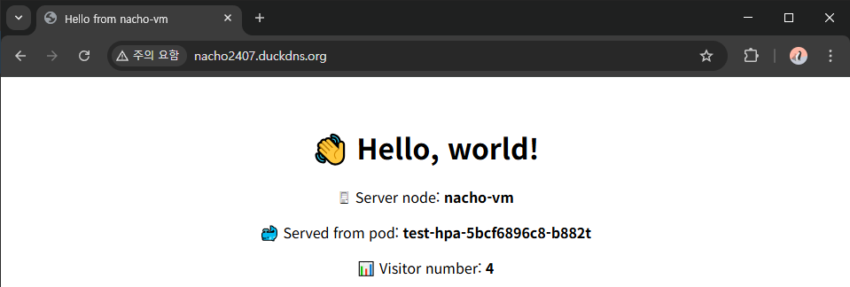
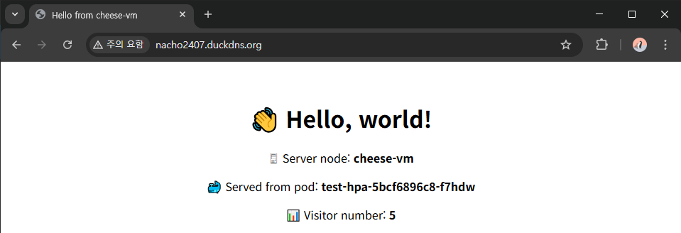
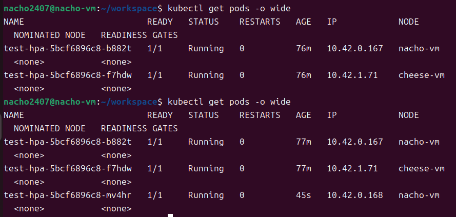
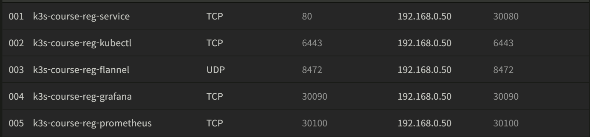
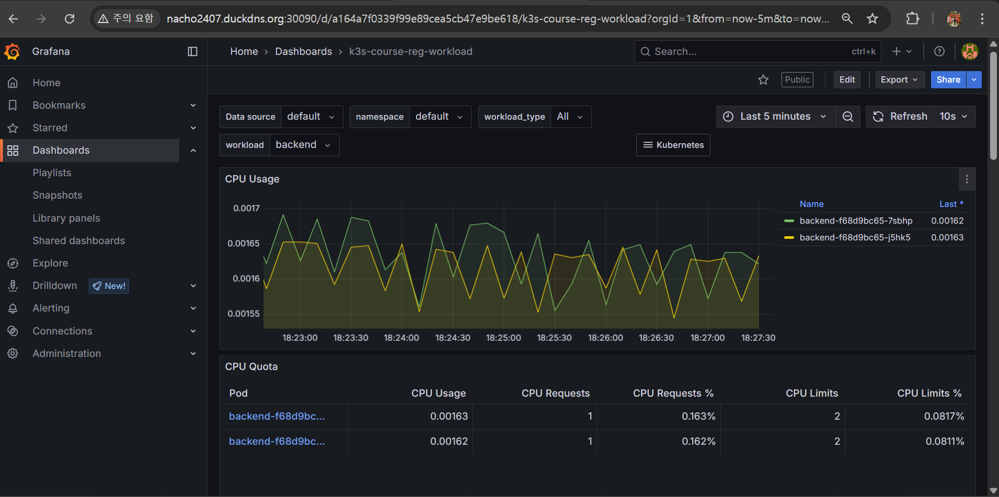
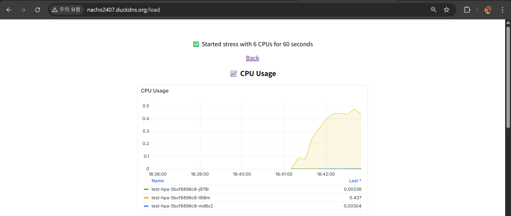

# ⚙ K3s 클러스터 구성 파트

부산대학교 정보컴퓨터공학부 2025학년도 1학기 클라우드컴퓨팅(김태운 교수님) 텀 프로젝트

**K3s 기반 다중 노드 Kubernetes 환경에서 안정적인 운영이 가능한 수강신청 서비스 개발**


## K3s 노드 설정 / 마스터 - 워커 연결

우선 K3s 환경을 구성할 시스템 환경을 설정한다. 다중 노드 K3s 시스템에서 각 노드들은 클러스터 내에서 **다른 노드들이 자신을 식별할 IP 주소를 설치 시 미리 설정**하고, 해당 IP 주소의 **정해진 포트로 통신**한다.

때문에 각 노드들이 서로 다른 네트워크 환경에 위치하여 다른 IP 주소, 다른 공유기를 사용 중이라면 통신 시 해결해야 할 장벽들이 많이 존재한다. 특히 교내 Wi-Fi 환경에서 클러스터를 구성하는 경우, **각 노드가 정보를 수신하기 위한 포트를 일일이 뚫어주어야(포워딩) 하기 때문에** 구성에 어려움이 있다. 이 문제를 해결하기 위해 **홈 라우터를 기준으로 동일한 LAN 환경 내에서 노드 간 사설 IP 주소를 통해 서로를 식별하도록 구성한다.** 쉽게 말해, 집에 있는 공유기를 이용하여 작은 데이터센터를 운영한다고 보면 된다.

K3s에서 노드 간 통신을 위해 사용하는 포트는 다음과 같다.

| 목적 | 포트 | 프로토콜 | 대상 |
|------|------|----------|------|
| K3s API 서버(`kubectl`) 접근 | 6443 | TCP | 마스터 |
| flannel VXLAN(파드 간 CNI) | 8472 | UDP | 마스터 / 워커 |
| NodePort 서비스 접속 | 30000 ~ 32767 | TCP / UDP | 마스터 / 워커 |

`kubectl`의 경우 외부에서 접속할 일이 없으면 크게 고민하지 않아도 되고, NodePort 또한 Ingress 서버 등 다른 서비스 방법을 이용한다면 그에 따른 다른 포트를 사용한다.

이 포트들은 단순히 포워딩만 해주면 끝나는 것이 아니라, 방화벽 인바운드 규칙 등 여러 설정을 통해 통신이 허가되어야 한다.


### 운영체제

컨테이너 오케스트레이션을 위해 존재하는 K3s는 기본적으로 컨테이너 가상화가 가능한 환경에서 작동해야 하므로 각 노드는 Linux 환경에서 동작해야만 하는데, 현재 마스터 노드로 사용할 데스크탑 컴퓨터는 Windows 10, 워커 노드로 사용할 랩탑 컴퓨터는 Windows 11 상에서 동작 중이다. 이전에 Docker의 경우에는 Windows에서 WSL을 사용하여 원활하게 사용이 가능했기에 이번에도 WSL을 이용하여 K3s 구성을 시도해보았으나, 노드 연결까지는 가능하더라도 flannel VXLAN이 정상적으로 작동하지 않았다. Windows - WSL 간 `netsh`(포트 포워딩) 설정을 제대로 하지 않았거나, Windows 방화벽 설정에 문제가 있었던 것 같다.

조사 결과 애초에 K3s 환경을 Windows 상에 WSL로 구성하는 경우가 없기도 하고, 이 경우에는 방화벽 설정 등 손 대야할 부분이 너무 많은 것 같아서 그냥 VirtualBox로 Ubuntu 가상 머신을 올려서 방화벽 다 끄고 구성하기로 한다. Windows 방화벽에 막히는 것을 막기 위해 VirtualBox 가상 머신은 홈 라우터에 바로 붙어 사설 IP 주소를 할당받을 수 있는 '어댑터에 브리지' 모드로 사용하도록 한다.


---

### 포트 포워딩

기존에 WSL로 구현할 때는 홈 라우터 포트 포워딩, Windows 방화벽 인바운드 규칙 설정, Windwos - WSL 네트워크 중계를 위한 `netsh` 설정, WSL 내 방화벽 설정 등등 포트 관련 수많은 설정이 필요했으나, 그냥 가상 머신 상에 방화벽 다 끄고 K3s 노드를 설정하는 경우 단순히 홈 라우터 포트 포워딩만 구성해주면 된다.


LAN의 게이트웨이 주소로 접속하여 홈 라우터 설정 페이지를 연 다음, 포트 포워딩 설정 화면에서 위 사진과 같이 포트를 터준다. 사실 6443 / TCP 포트는 외부에서 `kubectl`에 접근할 일이 없으면 열지 않아도 되고, 8472 / UDP 포트도 클러스터 내에서만 필요한 포트라 홈 라우터 포트 포워딩까지는 필요 없지만 혹시 몰라서 그냥 열어 두었다. WSL로 테스트할 때처럼 지옥을 또 경험하고 싶지는 않다.

**NodePort 서비스를 사용할 경우 반드시 30000번 이상의 포트 번호를 사용해야 한다.** 이번 프로젝트에서 구현할 서비스는 웹 서비스이므로 친숙한 80번 포트를 이용해 30080번 포트를 NodePort 접근용 포트로 사용한다. 외부에서는 80번 포트로 접근하도록 하여 웹 브라우저에서 포트 번호를 따로 명시하지 않고도 접속할 수 있도록 한다.

중요한 것은 포워딩할 IP 주소가 가상 머신이 돌아가는 호스트 OS의 네트워크 인터페이스에 할당된 사설 IP 주소가 아니라, 동일한 물리 네트워크 인터페이스를 사용하기는 하더라도 '어댑터에 브리지' 모드로 가상 머신을 사용하는 만큼, **가상 머신의 가상 네트워크 인터페이스에 할당된 사설 IP 주소로 포워딩**해주어야 한다는 것이다.

이후 가상 머신에서 방화벽을 모두 열어준다.

```Bash
sudo ufw disable
sudo ufw status
```


---

### 마스터 노드 설치

이제 마스터 노드로 사용할 가상 머신에서 K3s를 설치한다. K3s는 인터넷에서 단일 바이너리 파일을 받아 일부 환경 변수와 함께 설치해주면 된다.

```Bash
sudo apt update
sudo apt upgrade
sudo apt install build-essential curl
curl -sfL https://get.k3s.io | sh -s - server --node-ip <가상 머신의 사설 IP> --tls-san <가상 머신의 사설 IP> [--tls-san <추가로 사용할 DNS 주소>]
```

`node-ip`를 통해 클러스터 내에서 노드를 구분할 IP 주소를 알려준다. 외부에서 마스터 노드에 접근하거나 클러스터 내 노드 간 통신 시에는 K3s가 자동으로 TLS 인증서를 생성하여 인증 작업을 수행하는데, 만약 외부 DNS 주소를 사용할 예정이면 인증 과정에서 문제가 생기지 않도록 `tls-san`을 통해 추가로 명시해준다.

K3s의 설정 파일은 시스템 디렉토리 내에 존재하기 때문에, `kubectl`을 사용할 때마다 `su` 권한을 받아야 하는 불편이 있다. 좀 더 편하게 관리하기 위해 설정 파일을 홈 디렉토리로 옮겨온다.

```Bash
sudo cp /etc/rancher/k3s/k3s.yaml ~/.kube/config
sudo chown $USER:$USER ~/.kube/config
```

이를 K3s 환경 변수 `KUBECONFIG`를 통해 따로 설정하지 않고 바로 사용할 수 있도록 아래 명령어를 통해 `.bashrc` 파일에 추가해둔다.

```Bash
echo 'export KUBECONFIG=/etc/rancher/k3s/k3s.yaml' >> ~/.bashrc
source ~/.bashrc
```

DNS 사용을 위해 K3s 마스터 설치 시 `tls-san`을 설정해 두었다면 K3s 설정 파일에서도 `kubectl` 서버 주소를 `127.0.0.1`에서 DNS 주소로 변경해 주어야 한다.

```YAML
server: https://<DNS 주소>:6443
```

---

### 워커 노드 설치 & 마스터 - 워커 연결

**K3s에서 마스터 - 워커 노드 연결은 워커 노드 설치 시에 바로 수행된다.** 때문에 우선 마스터 노드의 IP 주소와 특정 토큰 값을 추가로 넘겨주어 지금 이 가상 머신에 설치하는 노드가 워커 노드라는 것을 K3s 설치 시에 확인한다.

마스터 노드의 토큰 값은 마스터 노드에서 아래 값을 통해 확인한다.

```Bash
sudo cat /var/lib/rancher/k3s/server/node-token
```

이후 워커 노드에서 아래와 같이 설치한다.

```Bash
sudo apt update
sudo apt upgrade
sudo apt install build-essential curl
curl -sfL https://get.k3s.io | K3S_URL=https://<마스터 노드의 사설 IP 주소>:6443 K3S_TOKEN=<마스터 노드에서 확인한 토큰 값> sh -s - --node-ip <워커 노드의 사설 IP 주소>
```

마스터 노드에서 아래와 같이 확인할 수 있으면 마스터 - 워커 연결에 성공한 것이다.

```Bash
kubectl get nodes
```


## 부하 분산

이제 본격적으로 부하 분산 기능을 사용해본다.


### 테스트 서버 개발

우선 FastAPI를 이용해 간단한 테스트 서버를 개발한다. 서버는 현재 해당 서버가 실행되고 있는 노드, 파드 이름과 방문자 수를 출력한다.

```Python
from fastapi import FastAPI, Request, Form
from fastapi.responses import HTMLResponse
import os
import socket

app = FastAPI()
count = 0
node_name = os.getenv("NODE_NAME", "unknown")
pod_name = socket.gethostname()


@app.get("/", response_class = HTMLResponse)
async def hello():
    global count
    count += 1

    html = f"""
        <html>
            <head>
                <title>Hello from {node_name}</title>
            </head>
            
            <body style="font-family:sans-serif; text-align:center; padding-top:3em">
                <h1>👋 Hello, world!</h1>

                <p>🖥 Server node: <strong>{node_name}</strong></p>

                <p>🐳 Served from pod: <strong>{pod_name}</strong></p>
                
                <p>📊 Visitor number: <strong>{count}</strong></p>
            </body>
        </html>
        """

    return HTMLResponse(content = html)

```

---

### 서버 컨테이너화

서버를 컨테이너화하기 위한 컨테이너 이미지를 Docker를 이용해 생성한다. Dockerfile은 아래와 같이 작성한다.

```Dockerfile
FROM python:3.13-slim

WORKDIR /app
COPY test.py .

RUN pip install fastapi uvicorn

CMD ["uvicorn", "test:app", "--host", "0.0.0.0", "--port", "80"]
```

Python 3.13의 slim 버전 이미지를 기반으로 `fastapi`, `uvicorn`을 pip로 설치 후 80번 포트로 실행한다. 이미지는 아래와 같이 생성하고 Docker Hub에 등록한다.

```Bash
cd <Dockerfile이 있는 위치>/
docker build -t <Docker Hub 아이디>/test .
docker login
docker push <Docker Hub 아이디>/test
```

---

### 배포 파일 작성

K3s로 Docker Hub에 등록한 서버 이미지를 배포하기 위해 설정 파일을 작성한다. YAML 파일을 이용하여 Kubernetes 환경에서 배포에 필요한 설정들을 작성하는데, 현재 상황에서는 크게 **파드의 생성, 복제, 업데이트를 관리할 `Deployment`**와 **파드에 접근하기 위한 네트워크 엔드포인트를 생성하는 `Service`**만 작성한다. 쉽게 비유하자면 `Deployment`는 가게를 여는 주인이고, `Service`는 고객들이 가게를 찾을 수 있도록 안내하는 간판이라고 보면 된다.

우선 `Deployment` 부분을 작성한다.

```YAML
apiVersion: apps/v1
kind: Deployment
metadata:
    name: test
spec:
    replicas: 2
    selector:
        matchLabels:
            app: <template 이름>
    template:
        metadata:
            labels:
                app: test
        spec:
            containers:
                - name: fastapi
                  image: <Docker Hub 아이디>/test
                  ports:
                      - containerPort: 80
                  env:
                      - name: NODE_NAME
                        valueFrom:
                            fieldRef:
                                fieldPath: spec.nodeName

```

2개의 파드를 클러스터 내에 배포하도록 설정하면 **자동으로 여러 노드에 균일하게 파드를 배포한다.** `template` 부분의 `env`로 `NODE_NAME` 환경 변수를 설정하는 것은 서버 상에서 Python의 `os.getenv`를 통해 현재 서버가 실행 중인 노드의 이름을 받아오기 위해 설정해두는 것이다. 단순히 `socket`에서 호스트 이름을 받아 출력하면 노드 이름이 아니라 파드 이름을 출력한다.

이제 외부에서 해당 파드들에 접근할 수 있도록 `Service` 부분을 작성한다. `Service`에서는 다양한 방법을 통해 외부에서 파드로 접근하도록 할 수 있지만, 이 상황에서는 간단하게 사용할 수 있도록 `NodePort`를 통해 `Service`를 정의한다.

원래 YAML은 객체마다 독립적인 파일을 작성해야 하지만, `---`를 통해 하나의 파일에 여러 객체를 정의할 수 있다.

```YAML
---
apiVersion: v1
kind: Service
metadata:
    name: test
spec:
    type: NodePort
    selector:
        app: <Deployment 이름>
    ports:
        - port: 80
          targetPort: 80
          nodePort: 30080

```

**`selector`에 접근할 파드의 이름을 정의해두면 설정한 포트로 요청이 들어올 때마다 해당 요청을 동일한 이름의 파드들에 라운드로빈 방식으로 분배한다.**

외부에서 사용자가 클러스터에 접근할 때는 `nodePort`에 정의한 포트로 접근하며, 해당 접근은 Kubernetes Service에 `port`에 정의한 포트로 연결된다. 이후 Kubernetes Service는 이 요청을 `targetPort`에 정의한 포트로 각 파드에 분배한다.

현재는 각 서버가 80번 포트로 오는 요청을 처리하고 있으므로 `targetPort`를 80으로 설정한다. 외부에서 접근하기 위한 `nodePort`는 홈 라우터 포트 포워딩에서 80:30080을 설정하였기 때문에 30080으로 설정한다. LAN 외부 환경에서 접근할 때는 단순히 80번 포트로 접속하면 된다.

---

### K3s 배포

마침내 부하 분산을 테스트할 준비가 되었다. 작성한 YAML 파일을 이용해 K3s에 서비스를 배포하여 부하 분산이 정상적으로 작동하는지 테스트한다. K3s 배포는 아래 명령어를 통해 간단하게 배포할 수 있다.

```Bash
kubectl apply -f <배포 파일>
```

이후 배포가 정상적으로 되었는지 확인하기 위해 아래 명령어를 통해 클러스터 내 파드 분포를 확인한다.

```Bash
kubectl get pods -o wide
```


웹 브라우저에서 실제 접속이 잘 되는지 확인한다.





웹 브라우저가 새로고침될 때마다 라운드로빈 방식으로 각 Pod의 응답을 받을 수 있다.


## 자동 확장(HPA)

부하 분산에 성공하였으니 이제 자동 확장을 구현해보자. Kubernetes에서 자동 확장은 보통 수평적으로 파드의 개수를 조절하는 HPA(Horizontal Pod Autoscaler)를 통해 구현한다. 우리의 목표는 각 파드의 CPU 부하가 높아지면 HPA를 통해 파드의 개수를 조절하는 것을 구현하는 것이다. 일반적으로 네트워크 상에서 작동하는 서비스는 CPU의 작업 처리 부하 뿐 아니라 네트워크 트래픽 부하도 확인하여 구현하지만, 우리의 경우에는 많은 네트워크 부하를 감당하기 어려운 홈 라우터 LAN 환경이라 단순히 CPU 부하를 통해 자동 확장을 구현하도록 한다.


### CPU 로드 API 추가

원활한 테스트를 위해 테스트 서버에 `/load`라는 API 요청을 추가한다. 서버가 해당 요청을 받으면 Linux 상에서 사용할 수 있는 stress 도구를 활용하여 CPU의 부하를 크게 늘린다. 프론트엔드에 몇 초간 부하를 줄 지 입력하고 Commit 버튼을 누르면 해당 시간만큼 요청을 받은 Pod의 부하가 늘어나도록 한다.

```Python
from fastapi import FastAPI, Request, Form
from fastapi.responses import HTMLResponse
import os
import socket
import subprocess

app = FastAPI()
count = 0
node_name = os.getenv("NODE_NAME", "unknown")
pod_name = socket.gethostname()


@app.get("/", response_class = HTMLResponse)
async def hello():
    global count
    count += 1

    html = f"""
        <html>
            <head>
                <title>Hello from {node_name}</title>
            </head>
            
            <body style="font-family:sans-serif; text-align:center; padding-top:3em">
                <h1>👋 Hello, world!</h1>

                <p>🖥 Server node: <strong>{node_name}</strong></p>

                <p>🐳 Served from pod: <strong>{pod_name}</strong></p>
                
                <p>📊 Visitor number: <strong>{count}</strong></p>

                <form action="/load" method="post">
                    <label>💣 CPU Load</label>

                    <input type="number" id="duration" name="duration" min="1" max="300" value="60">

                    <input type="submit" value="Commit">
                </form>
            </body>
        </html>
        """

    return HTMLResponse(content = html)


@app.post("/load", response_class = HTMLResponse)
async def load(duration: int = Form(...)):
    cpus = os.cpu_count() or 1

    try:
        subprocess.Popen(
            ["stress", "--cpu", str(cpus), "--timeout", str(duration)],
            stdout=subprocess.DEVNULL,
            stderr=subprocess.DEVNULL
        )

        result = f"✅ Started stress with {cpus} CPUs for {duration} seconds"
    except Exception as e:
        result = f"❌ Failed to start stress: {e}"

    html = f"""
        <html>
            <head>
                <title>CPU Load</title>
            </head>

            <body style="font-family:sans-serif; text-align:center; padding-top:3em">
                <p>{result}</p>

                <p><a href="/">Back</a></p>
            </body>
        </html>
        """

    return HTMLResponse(content = html)

```

파드 내에서 stress를 사용할 수 있도록 Dockerfile도 수정해준다.

```Dockerfile
FROM python:3.13-slim

RUN apt update && apt upgrade -y && apt install -y gcc stress curl && apt clean

RUN pip install --no-cache-dir fastapi uvicorn python-multipart

COPY test.py /app/main.py

WORKDIR /app

CMD ["uvicorn", "main:app", "--host", "0.0.0.0", "--port", "80"]

```

참고로 `/load` API를 처리할 때 HTML의 `<form>` 형식으로 값을 받는데, 이를 Python 코드 상에서 처리하기 위해서는 pip를 통해 python-multipart라는 파서를 추가로 설치해주어야 한다.

수정한 Dockerfile은 `docker build -t <이미지 태그> .`를 통해 다시 빌드한다. 이미지 태그를 이전과 동일하게하면 새로운 이미지가 생성되지 않고 동일한 태그의 이미지를 덮어쓰기한다. `docker push <이미지 태그>`로 Docker Hub에 푸시할 때도 동일하다.

---

### metrics-server 확인

자동 확장 기능을 구현하기 위해서는 각 노드, 파드 별 컴퓨팅 리소스 사용량을 지속적으로 확인할 수 있어야 한다. Kubernetes에서는 이를 metrics-server가 확인하는데, K3s는 기본적으로 kube-system 네임스페이스 아래에 metrics-server를 구동하고 있지만, 혹시 모르니 kubectl로 확인해본다.

```Bash
kubectl get deployment metrics-server -n kube-system
```

만약 metrics-server가 작동하고 있지 않다면, 아래 명령어로 설치한다.

```Bash
kubectl apply -f https://github.com/kubernetes-sigs/metrics-server/releases/latest/download/components.yaml
```

이후 `kubectl top [pods] [nodes]`로 파드, 노드별 컴퓨팅 리소스 사용량을 확인할 수 있다.

---

### `Deployment` 리소스 제한

Kubernetes의 HPA는 우리가 처음 생각한 방식과는 조금 다르게 동작했다. 처음 의도한 자동 확장은 클러스터 내의 일부 노드에서 CPU 전체 사용량이 크게 높아지면 다른 노드로 파드를 늘리는 방식을 생각했었다. 하지만 HPA를 정석적으로 활용하는 방법은, 클러스터 내의 노드 개수와 상관 없이 파드가 사용할 수 있는 리소스를 제한해두고 기준치 이상의 리소스가 사용되는 경우 클러스터 내에서 작동하는 파드의 개수를 늘려 여러 노드에 분산시키는 것이다.

때문에 각 파드의 컴퓨팅 리소스를 제한하고 HPA가 트리거될 기준치를 정해주어야 한다. 배포 파일의 `Deployment` 부분에서, 각 Pod의 템플릿을 정의하는 부분(`spec.template.spec.containers`)에 아래 내용을 추가한다.

```YAML
resources:
    requests:
        cpu: "1000m"
    limits:
        cpu: "2000m"
```

여기서 `m`은 $\frac{1}{1000}$을 의미한다. 위의 내용은 각 Pod가 클러스터에 요청하는 리소스 중, CPU를 기본(최소)적으로 1개(논리 프로세서 기준) 요청하면서, 추가로 리소스가 필요한 경우 최대 2개까지 요청이 가능하도록 설정한 것이다. 부하 분산을 테스트할 때는 이 부분을 따로 명시하지 않았었는데, `requests`를 명시하지 않으면 기본값은 0이며, `limits`를 명시하지 않으면 노드가 사용할 수 있는 최대 CPU까지 사용할 수 있다. 설정이 잘 되었는지는 파드가 실행된 후 `kubectl describe pod <파드 이름>`을 통해 확인할 수 있다.

---

### HPA 설정

이제 본격적으로 HPA를 설정해보자. 배포 설정 파일에 `HorizontalAutoScaler`를 추가하기 위해 아래와 같이 작성해준다.

```YAML
apiVersion: autoscaling/v2
kind: HorizontalPodAutoscaler
metadata:
    name: test-hpa
spec:
    scaleTargetRef:
        apiVersion: apps/v1
        kind: Deployment
        name: <Deployment 이름>
    minReplicas: 2
    maxReplicas: 4
    metrics:
        - type: Resource
          resource:
              name: cpu
              target:
                  type: Utilization
                  averageUtilization: 80
    behavior:
        scaleUp:
            stabilizationWindowSeconds: 0
            policies:
                - type: Pods
                  value: 1
                  periodSeconds: 60
        scaleDown:
            stabilizationWindowSeconds: 120
            policies:
                - type: Pods
                  value: 1
                  periodSeconds: 60
```

위 코드는 작성해둔 배포 설정 파일 아래에 `---`로 파일을 구분하여 추가한다. 위 설정은 이름을 통해 자동 확장을 적용할 `Deployment`를 설정하고, 최소 2개의 파드를 배포하다가 자동 확장으로 인해 Scale Up되면 최대 4개의 파드가 클러스터 내에서 돌아가도록 한다. 기준치는 파드의 평균 CPU 사용량이 80%를 넘어가는 상태이며, 해당 상태가 60초 이상 지속되면 파드 개수를 하나 늘린다.

파드 개수 조정이 너무 자주 일어나지 않도록 하기 위해 Scale Down 조건에는 2분의 안정화 시간을 준다. 파드의 평균 CPU 사용량이 80%를 넘지 않는 상태가 1분 이상 지속되더라도 개수가 조정된지 120초가 지나지 않았다면 Scale Down이 일어나지 않도록 제한한다.


### K3s 재배포

이제 수정한 배포 파일을 이용하여 서비스를 K3s 클러스터에 재배포한다. 배포 파일을 다시 적용하는 방법은 다양하지만, 가장 깔끔하게 재배포하는 방법은 그냥 해당 배포를 지우고 다시 배포하는 것이다.

```Bash
kubectl delete -f <이전 배포 파일>
```

`-f` 옵션을 통해 이전 배포 파일을 이용하여 깔끔하게 현 배포를 제거할 수 있다. 지금은 큰 변화 없이 배포 파일에 HPA만 추가된 상태이므로, 수정한 파일로 `delete`하여도 HPA 부분만 삭제할 것이 없다는 경고가 나오고 나머지는 잘 지워진다. 이후 아래와 같이 재배포한다.

```Bash
kubectl apply -f <배포 파일>
```

서비스에 접속하여 Load를 테스트 해보면 1분 뒤 파드 개수가 늘어나면서 아래와 같이 자동 확장이 잘 되는 것을 확인할 수 있다.




## Prometheus + Grafana를 통한 시각화

부하 분산이나 자동 확장이 잘 일어나고 있다는 것을 서비스의 관리자 페이지 등에서 쉽게 확인할 수 있도록 시각화 자료를 추가해보자. K3s의 각종 메트릭을 쿼리하고 이를 그래프로 예쁘고 표시하기 위해서는 Prometheus와 Grafana를 이용할 수 있다.

### Helm 설치 및 설정

Prometheus 및 Grafana는 Kubernetes나 K3s에 포함되지 않은 외부 도구로, K3s에서 사용하려면 외부에서 받아 설치하여야 한다. 보통 Kubernetes 환경에서는 외부 도구를 추가 설치할 때 Kubernetes 애플리케이션을 관리하는 Helm이라는 패키지 매니저를 사용한다. 다음과 같이 curl을 이용해 Helm을 다운로드하고 설치한다.

```Bash
curl https://raw.githubusercontent.com/helm/helm/master/scripts/get-helm-3 | bash
```

이후 Helm을 통해 Prometheus와 Grafana를 관리하기 위해 저장소를 추가해준다.

```Bash
helm repo add prometheus-community https://prometheus-community.github.io/helm-charts
helm repo update
```

---

### Prometheus + Grafana 설치

Helm을 사용하면 Prometheus와 Grafana와 관련된 모든 파드들을 Helm이 생성 / 배포 / 오류나 업데이트 시 재배포까지 처리해주기 때문에 매우 편리한데, 다만 생성되는 파드들이 많아 모니터링과 관련된 파드들은 다른 네임스페이스로 분리하여 관리하는 것이 편하다. 사실 지금까지는 파드의 네임스페이스를 딱히 신경쓰지 않았는데, 따로 명시하지 않으면 기본 네임스페이스인 `default`에 포함된다. 우선 아래와 같이 모니터링용 파드들을 분류할 `monitoring` 네임 스페이스를 생성한다.

```Bash
kubectl create namespace monitoring
```

이제 Helm을 통해 Prometheus와 Grafana 등을 설치해보자. `prometheus-community`에서는 `kube-prometheus-stack`이라는 Helm Charts(애플리케이션 패키지 묶음)를 통해 Alertmanager나 Grafana같이 Kubernetes에서 Prometheus와 사용하기 좋은 툴들을 묶어 배포한다.

```Bash
helm install prometheus prometheus-community/kube-prometheus-stack -n monitoring
```

설치가 끝난 후에는 `kubectl get pods -o wide -n monitoring`을 통해 배포중인 Prometheus 관련 파드들을 확인할 수 있다.

---

### 추가 설정

'이제 끝!'인 줄 알았지만 아직 중요하게 설정해주어야 할 것이 남았다. 우선 아래의 Helm 설정 파일을 보자.

```YAML
prometheus:
    prometheusSpec:
        scrapeInterval: 10s
        evaluationInterval: 10s
        nodeSelector:
            kubernetes.io/hostname: <마스터 노드 이름>

alertmanager:
    alertmanagerSpec:
        nodeSelector:
            kubernetes.io/hostname: <마스터 노드 이름>

grafana:
    adminUser: <관리자 아이디>
    adminPassword: <관리자 비밀번호>
    nodeSelector:
        kubernetes.io/hostname: <마스터 노드 이름>
    env:
        GF_SECURITY_ALLOW_EMBEDDING: true
        GF_SECURITY_COOKIE_SAMESITE: lax
        GF_SERVER_DOMAIN: <DNS 주소>
        GF_SERVER_ROOT_URL: http://<DNS 주소>:30090/
        GF_SERVER_SERVE_FROM_SUB_PATH: false
    grafana.ini:
        auth.anonymous:
            enabled: true
            org_role: Viewer
        security:
            allow_embedding: true
    persistence:
        enabled: true
        accessModes:
            - ReadWriteOnce
        size: 1Gi
        storageClassName: standard

global:
    nodeSelector:
        kubernetes.io/hostname: <마스터 노드 이름>
```

우선 `prometheus`, `grafana`, `alertmanager`와 혹시 모를 `global`까지 `nodeSelector`를 통해 마스터 노드에서만 배포되도록 제한한다. Prometheus나 Grafana같은 경우에는 현재 프로젝트에서 외부에서 접근할 수 있는 상태여야 하는데, `monitoring` 네임스페이스 내의 파드들은 따로 부하 분산이 설정되어 있지 않은 것인지, 이 애플리케이션들이 워커 노드에서 돌아가게 되면 외부에서 접근하지 못하게 된다.

`prometheus`에서는 `scrapeInterval`과 `evaluationInterval`을 적절하게 조절해준다. 이를 따로 설정하지 않으면 기본값이 1분으로 되어있는데, 현재 프로젝트에서는 CPU의 부하가 늘어나고 파드들이 늘어나는 것을 실시간으로 확인할 수 있어야 하므로 모니터링으로 인한 부하 부담과 적절히 타협하여 10초에 한 번 메트릭하도록 한다.

`grafana` 설정이 눈여겨 보아야 할 것들이 많다. 우선 관리자 아이디와 비밀번호를 사전에 설정하여 헷갈릴 일이 없도록 한다. 따로 설정하지 않으면 기본값으로 `admin` / `prom-operator`가 들어간다.

Grafana의 대시보드 그래프는 기본적으로 외부 웹 페이지에서 임베딩을 못하도록 막혀있는데, 이를 설정을 통해 뚫어주어야 한다. `env` 아래의 모든 설정들이 꼭 필요한 설정들이므로 모두 포함시키도록 한다. 특히 `GF_SECURITY_COOKIE_SAMESITE`의 경우에는 `lex`가 아닌 `none` 등으로 설정하면 HTTP + 임베딩 환경에서 그래프가 제대로 보이지 않으니 반드시 `lex`로 설정해주어야 한다.

`grafana.ini` 부분은 외부에서 Grafana 대시보드 그래프에 접근 시 로그인 없이도 접근할 수 있도록 하기 위함이다. 저 부분을 설정하지 않으면 외부에서 접근 시 연결이 제대로 되더라도 관리자 아이디를 일일이 로그인 해주어야 한다.

Grafana 대시보드에서 우리가 원하는 설정을 저장 후 서버가 재시작되더라도 유지되도록 하기 위해 `persistence` 설정을 통해 1GB 정도의 지속 유지되는 볼륨을 추가한다.

이 설정을 `prom_config.yaml` 파일로 저장하고, Helm을 통해 적용하기 위해서는 아래와 같이 관련 서비스들을 업데이트해주어야 한다.

```Bash
helm upgrade prometheus prometheus-community/kube-prometheus-stack -n monitoring -f prom_config.yaml
```

---

### 추추가 설정

아직도 설정할 것이 남았다! Prometheus와 Grafana는 기본적으로 클러스터 내에서 관리자들이 사용할 수 있도록 만들어진 것이기 때문에 외부에서 해당 파드들에 접속할 수 있도록 하기 위해서는 서비스 타입을 NodePort 등으로 바꾸어줄 필요가 있다. Grafana와 Prometheus에 각각 30090번, 30100번을 할당하여 NodePort로 서비스 타입을 변경하는 명령어는 아래와 같다.

```Bash
kubectl patch svc prometheus-kube-prometheus-prometheus -n monitoring -p '{"spec": {"type": "NodePort", "ports": [{"port": 9090, "nodePort": 30100, "protocol": "TCP", "targetPort": 9090}]}}'
kubectl patch svc prometheus-grafana -n monitoring -p '{"spec": {"ports": [{"port": 80, "targetPort": 3000, "protocol": "TCP", "nodePort": 30090}], "type": "NodePort"}}'
```

당연히 공유기의 포트포워딩 설정도 추가해주어야 한다.



---

### Grafana 대시보드 설정

이제 준비가 되었으니 Grafana 대시보드에서 사용할 그래프를 설정하고 이를 서비스에 임베딩해보자. Grafana는 주제별로 미리 정의된 그래프 템플릿들을 모아놓은 대시보드들로 구성되는데, 이미 템플릿으로 등록된 대시보드는 수정이 어렵기 때문에 해당 대시보드를 새로 임포트하여 수정하도록 한다.

대시보드를 임포트하는 것이 가능한 이유는, Grafana의 대시보드는 JSON 파일로 추출이 가능하기 때문이다! 설정한 DNS에 포트 30090번을 입력하여 Grafana 관리 창을 열고, 모든 설정 값을 담은 JSON 파일을 새로 임포트하여 열어본 화면은 아래와 같다.



참고로 해당 대시보드를 수정할 권한을 받으려면 우선 로그인해야한다.

이제 대시보드에 원하는 그래프를 하나 골라잡아서 오른쪽 위 설정 탭을 열어 공유 옵션에서 임베드 공유 옵션을 선택하면 아래와 같은 코드를 얻을 수 있다.

```HTML
<iframe src="http://<설정한 DNS 주소>:30090/d-solo/<대시보드 구분을 위한 ID>/<대시보드 이름>?orgId=1&timezone=browser&var-datasource=default&var-cluster=&var-namespace=default&var-type=$__all&var-workload=backend&refresh=10s&theme=light&panelId=1&__feature.dashboardSceneSolo" width="450" height="200" frameborder="0"></iframe>
```

임베드 코드를 받아올 때 시간을 잠그는 옵션을 꺼주어야 실시간으로 그래프를 받아올 수 있다.

해당 코드를 임베드하여 로드 API 호출 시 반환할 페이지에 그래프를 추가해보자.

```Python
@app.post("/load", response_class = HTMLResponse)
async def load(duration: int = Form(...)):
    cpus = os.cpu_count() or 1

    try:
        subprocess.Popen(
            ["stress", "--cpu", str(cpus), "--timeout", str(duration)],
            stdout=subprocess.DEVNULL,
            stderr=subprocess.DEVNULL
        )

        result = f"✅ Started stress with {cpus} CPUs for {duration} seconds"
    except Exception as e:
        result = f"❌ Failed to start stress: {e}"

    html = f"""
        <html>
            <head>
                <title>CPU Load</title>
            </head>

            <body style="font-family:sans-serif; text-align:center; padding-top:3em">
                <p>{result}</p>

                <p><a href="/">Back</a></p>

                <h3 stype="text-align: center">📈 CPU Usage</h3>
                <임베드 코드>
            </body>
        </html>
        """

    return HTMLResponse(content = html)
```

로드를 수행하면 다음과 같이 예쁜 그래프를 볼 수 있다.


