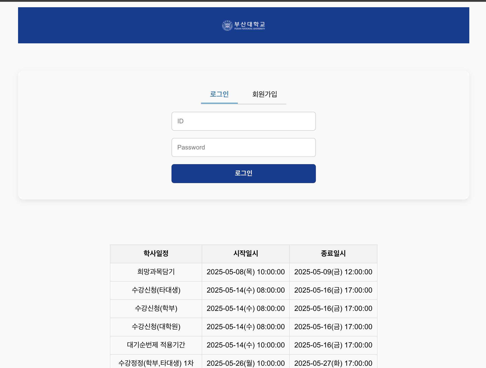
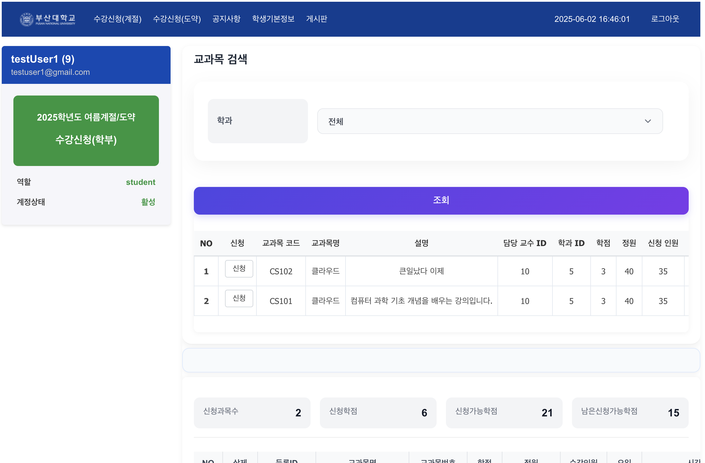
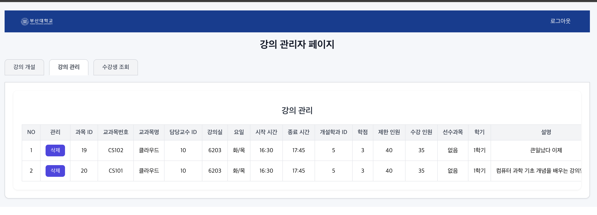

🎓 MyCourseRegistrationApp

React를 기본으로 한 대학 수강신청 시스템 프론트엔드입니다.

대학 관리자 및 학생을 위한 수강 신청 및 관리 인터픽스 제공

🖼️ 스크린샷





🛠️ 사용 기술 스탭

⚛️ React 18

🧽 React Router

📦 Vite

🎨 CSS Modules

📁 폴더 구조
<pre> ``` 📁 sugang-system/ ├── node_modules/ ├── public/ ├── screenshots/ │ └── main.png ├── src/ │ ├── App.js │ └── pages/ │ ├── AdminPage.jsx / AdminPage.css │ ├── LoginPage.jsx / LoginPage.css │ ├── MainPage.jsx / MainPage.css │ ├── RegisterPage.jsx / RegisterPage.css │ └── SystemAdminPage.jsx / SystemAdminPage.css ├── .env ├── package.json └── README.md ``` </pre>

⚙️ 설치 및 실행

# 1. 저장소 클론
git clone https://github.com/jiwoong5/Team-Cloud-9.git

# 2. 디렉토리 이동
cd frontend/sugang-system

# 3. 의연성 설치
npm install

# 4. 개발 서버 실행
npm start

🌐 환경 변수 설정

.env 파일을 프로젝트 루트에 생성하고 다음과 같이 작성합니다:

REACT_APP_API_BASE_URL=https://your-api-server.com

🧪 현재 이슈

📱 반응형 디자인 미혜택 → 추후 Tailwind / MUI 도입 예정

♻️ 중복 코드 존재 → 공통 코드 구 예정

📟 라이선스

MIT License © 2025 Team Cloud 9


